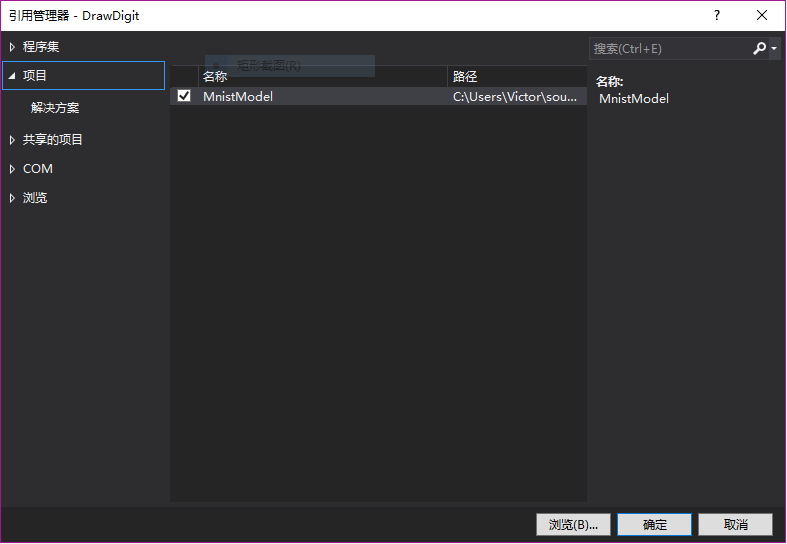
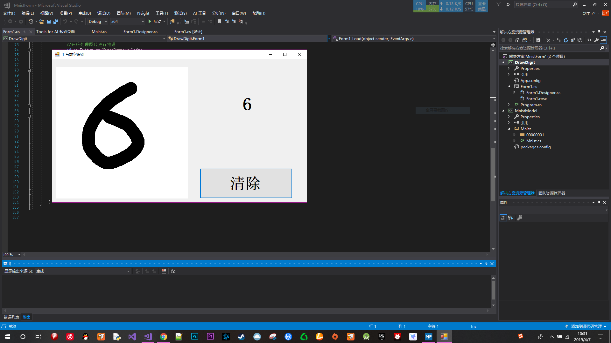

基于Mnist训练的AI模型进行手写数字识别应用的开发案例
-

准备工作
===
- 更新系统与驱动的x64位操作系统的计算机

- 环境配置完毕，已训练好的Mnist模型
 
####一 、 简介

- 利用上一次训练好的Mnist模型，以此来搭建手写数字识别的框架
- 创建初始界面，供后续添加按钮做准备
- 将添加的组件进行包装
- 我们选择使用TensorFlow来训练MNIST模型
- 通过AI中的模型推理类来完成识别功能

####二 、 过程

- 首先将程序运行的模板构建出来，新建Windows窗体程序 ，命名为DrawDigit  
      

在**DrawDigit**项目上点击右键，选择属性，在生成一栏将平台目标从Any CPU改为**x64**。否则，DrawDigit（首选32位）与它引用的MnistForm（64位）的编译平台不一致会引发System.BadImageFormatException的异常。
  

- 在设计图左边的工具箱中添加需要的组件，label（标签），button（按钮），picturebox（识别手写数字的区域）

- 通过调整与设置吧各个组件改成自己需要的属性

1. **pictureBox1	在Mouse下双击MouseDown、MouseUp、MouseMove来生成对应的响应事件函数**。
2. **button1	如上，在Action下双击Click**。

3. **Form1	如上，在Behavior下双击Load**。
 

接下来是最重要的环节，对各个组件添加事件，在属性界面对需要的组件进行绑定操作，接下来在代码部分会自动生成代码，先把地基打好，然后再开始建“房子”，下面是对生成的Form进行的代码操作

       using System;
       using System.Collections.Generic;
       using System.ComponentModel;
       using System.Data;
	   using System.Drawing;
	   using System.Drawing.Drawing2D;         //用于优化绘制的结果
	   using System.Linq;
	   using System.Text;
	   using System.Threading.Tasks;
	   using System.Windows.Forms;
	   using MnistModel;       //对新建的model引用，防报错

    namespace DrawDigit
	{
    public partial class Form1 : Form
    {
        public Form1()
        {
            InitializeComponent();
        }

	private Bitmap digitImage;    //用来保存手写数字
        private Point startPoint;    //用于绘制线段，作为线段的初始端点坐标
        private Mnist model;   //用于识别手写数字
        private const int MnistImageSize = 28;   //Mnist模型所需的输入图片大小

        private void Form1_Load(object sender, EventArgs e)
        {
            //当窗口加载时，绘制一个白色方框
            model = new Mnist();
            digitImage = new Bitmap(pictureBox1.Width, pictureBox1.Height);  //定义书写框长度和高度
            Graphics g = Graphics.FromImage(digitImage);
            g.Clear(Color.White);  //修改书写框的背景色
            pictureBox1.Image = digitImage;
        }

        private void clean_click(object sender, EventArgs e)
        {
            //当点击清除时，重新绘制一个白色方框，同时清除label1显示的文本
            digitImage = new Bitmap(pictureBox1.Width, pictureBox1.Height);
            Graphics g = Graphics.FromImage(digitImage);
            g.Clear(Color.White);
            pictureBox1.Image = digitImage;
            label1.Text = "";
        }

        private void pictureBox1_MouseDown(object sender, MouseEventArgs e)
        {
            //当鼠标左键被按下时，设置isPainting为true，并记录下需要绘制的线段的起始坐标
            startPoint = (e.Button == MouseButtons.Left) ? e.Location : startPoint;
        }

        private void pictureBox1_MouseMove(object sender, MouseEventArgs e)
        {
           
            if (e.Button == MouseButtons.Left)
            {
                Graphics g = Graphics.FromImage(digitImage);
                Pen myPen = new Pen(Color.Black, 40);
                myPen.StartCap = LineCap.Round;
                myPen.EndCap = LineCap.Round;
                g.DrawLine(myPen,startPoint, e.Location);
                pictureBox1.Image = digitImage;
                g.Dispose();
                startPoint = e.Location;   //当鼠标在移动，且当前处于绘制状态时，根据鼠标的实时位置与记录的起始坐标绘制线段，      同时更新需要绘制的线段的起始坐标
            }
        }

        private void pictureBox1_MouseUp(object sender, MouseEventArgs e)
        {
            //当鼠标左键释放时
            //同时开始处理图片进行推理

            if (e.Button == MouseButtons.Left)
            {
                // 复制pictureBox中的图片并缩放到28*28成为新的图片(tmpBmp)
                Bitmap tmpBmp = new Bitmap(digitImage, MinstImageSize, MinstImageSize);
                //将图片转为灰阶图，并将图片的像素信息保存在list中
                var imageData = new List<float>(MnistImageSize * MnistImageSize);
                for (var y = 0; y < MnistImageSize; y++)
                {
                    for (var x = 0; x < MnistImageSize; x++)
                    {
                        var color = tmpBmp.GetPixel(x, y);
                        var pixel = (float)(0.5 - (color.R + color.G + color.B) / (3.0 * 255));
                        imageData.Add(pixel);
                    }
                }
                //将图片信息包装为mnist模型规定的输入格式
                var batchData = new List<IEnumerable<float>>();
                batchData.Add(imageData);
                //将图片传送给mnist模型进行推理
                var result = model.Infer(batchData);
                //将推理结果输出
                label1.Text = result.First().First().ToString();
            }
        }

        }
    }

-  接下来会发现整个代码Mnist错误，不要着急。

-  接下来把模型包装成类添加->新建项目，在弹出的窗口里选择 **AI Tools->Inference->**模型推理类库，名称不妨叫做 **MnistModel**，点击确定，于是又多了一个项目，然后把之前Mnist导入，会自动设置input和output

    

 

-  然后用之前的项母引用新建的Mnist项目，然后双击Mnist.cs，我们可以看到项目自动把模型进行了封装，生成了一个公开的infer函数

-   然后尝试运行，结果如下

## 结果展示 ##
 

 
		
 

    结果会发现，我们训练的Mnist手写数字识别并不是很准确，更甚者只能识别一位数字。 归根结底，上述现象的症结在于：
    作为我们人工智能应用核心的模型，本身并不具备识别多个数字的能力——作为模型的源头，也即是训练数据的MNIST数据集
    只覆盖了单个的手写数字。并且，在应用的输入处理部分， 我们并未对笔迹图形作额外的处理，所以得到的结果不尽人意

【注】
===
那么如果我们要求我们的应用既能识别单位数字又能识别多位数字和符号，又能识别同时出现的多个字符：首先对于多个数字这种情况，我们很自然地想到，既然MNIST模型已经能很好地识别单个数字，那我们只需要把多个数字分开，一个一个地让MNIST模型进行识别；对于识别其他数学符号，我们可以尝试通过扩展MNIST模型的识别范围，也就是扩展MNIST数据集来实现。两者合二为一，就是一种非常可行的解决方案。

